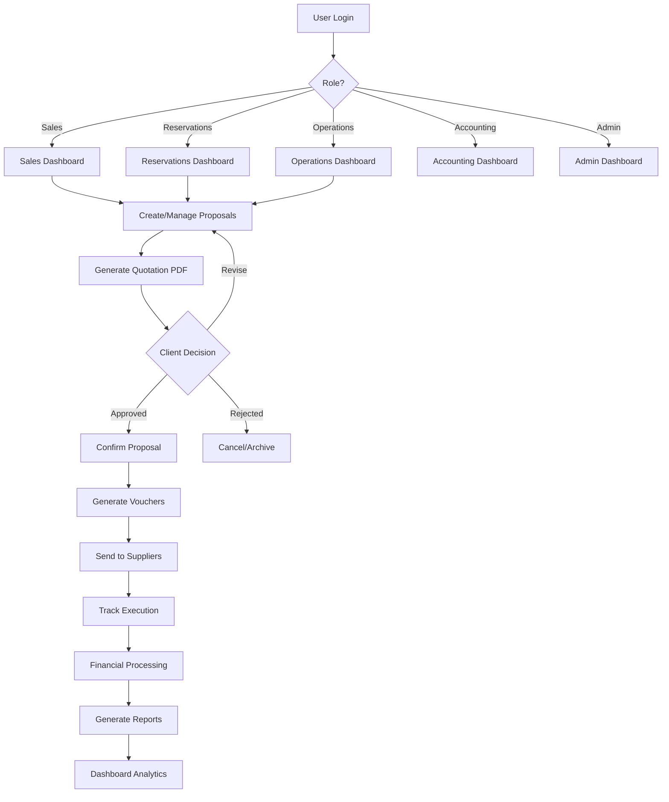
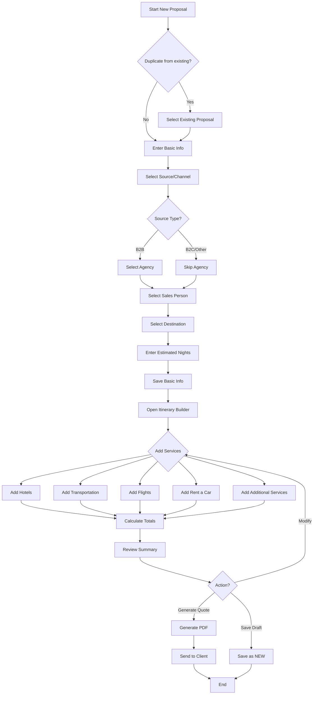
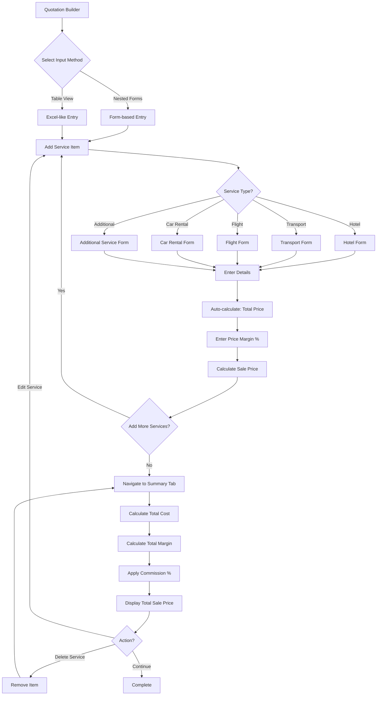
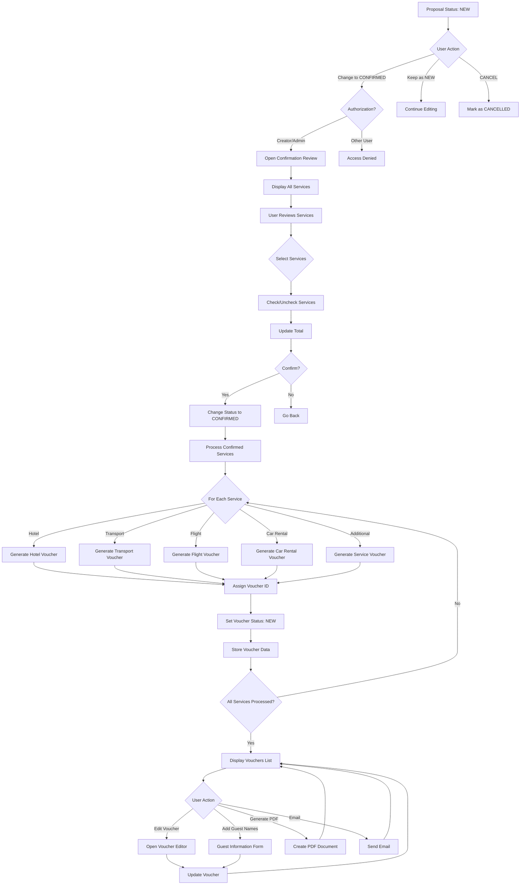
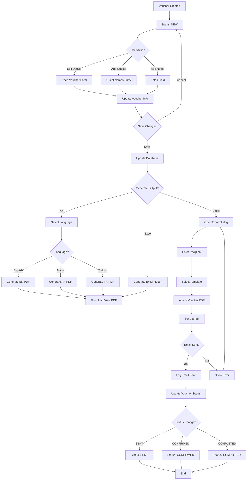
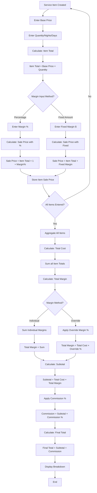
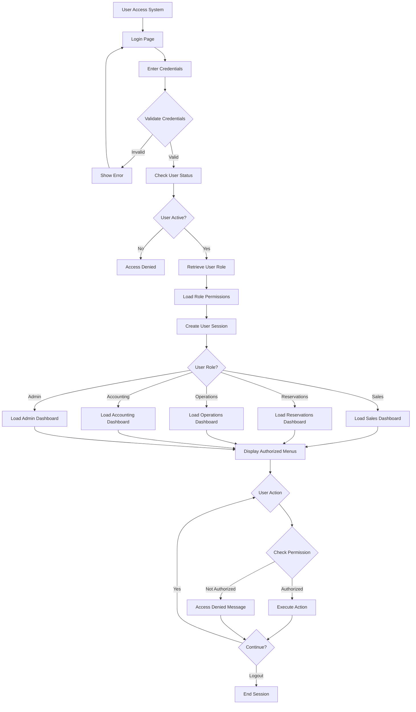
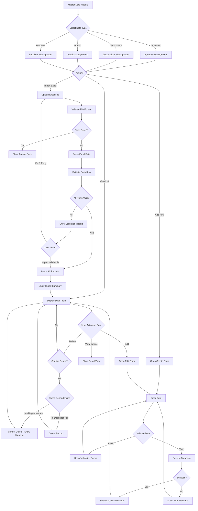
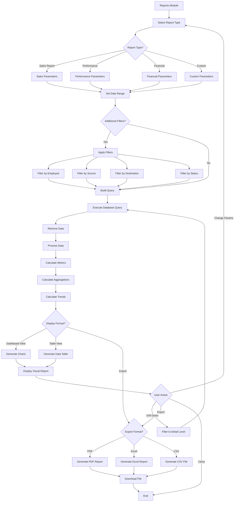
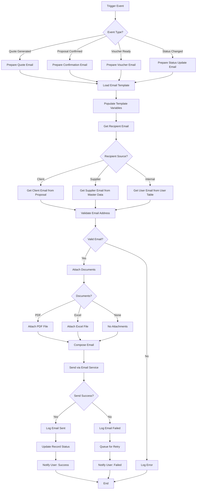

# TOMS - System Flowcharts

## 1. OVERALL SYSTEM WORKFLOW

---

## 2. PROPOSAL CREATION WORKFLOW

---

## 3. QUOTATION BUILDER DETAILED FLOW

---

## 4. CONFIRMATION & VOUCHER GENERATION WORKFLOW

---

## 5. VOUCHER MANAGEMENT WORKFLOW

---

## 6. PRICING CALCULATION FLOW

---

## 7. USER AUTHENTICATION & AUTHORIZATION FLOW

---

## 8. MASTER DATA MANAGEMENT FLOW

---

## 9. REPORTING & ANALYTICS FLOW

---

## 10. EMAIL NOTIFICATION FLOW

---

## KEY DECISION POINTS IN SYSTEM

### 1. **Proposal Creation**
- Duplicate existing vs Create new
- B2B (requires agency) vs B2C/Other
- Input method: Nested forms vs Table view

### 2. **Pricing Strategy**
- Individual item margins vs Overall margin override
- Percentage-based vs Fixed amount margins
- Commission application (optional)

### 3. **Confirmation Process**
- Only creator/admin can confirm
- Selective service inclusion (not all services must be confirmed)
- Automatic voucher generation upon confirmation

### 4. **Voucher Language**
- Multi-language support (EN/AR/TR)
- Language selection per voucher
- Language affects PDF template

### 5. **User Permissions**
- Role-based access control
- Own data vs All data access
- Read-only vs Edit permissions

### 6. **Data Management**
- Manual entry vs Excel import
- Hierarchical location selection
- Dependency checks before deletion

### 7. **Reporting Scope**
- Time period selection
- Filter granularity
- Export format preference

---

## NOTES

These flowcharts represent the core business logic and decision points in the TOMS system. Each workflow:

1. **Shows clear entry and exit points**
2. **Includes decision diamonds for branching logic**
3. **Demonstrates data validation steps**
4. **Indicates error handling paths**
5. **Shows integration points between modules**

The flowcharts can be implemented using:
- **Mermaid.js** for live rendering in documentation
- **Lucidchart** or **Draw.io** for detailed design
- **BPMN notation** for business process mapping
