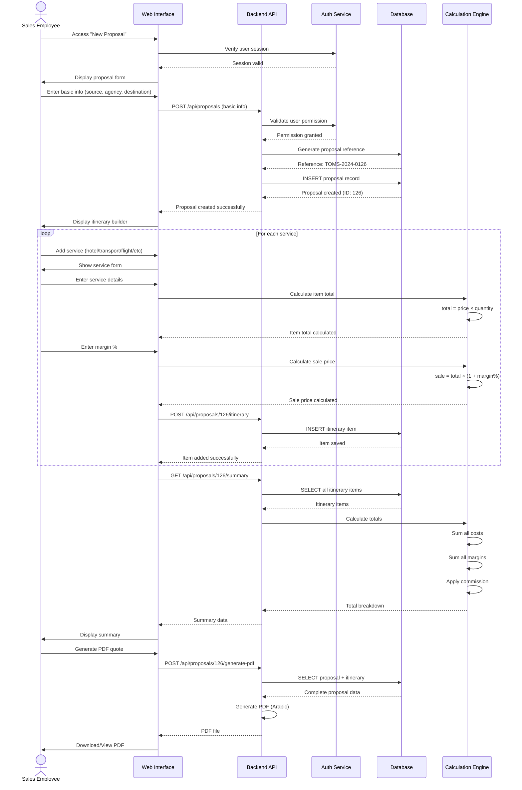
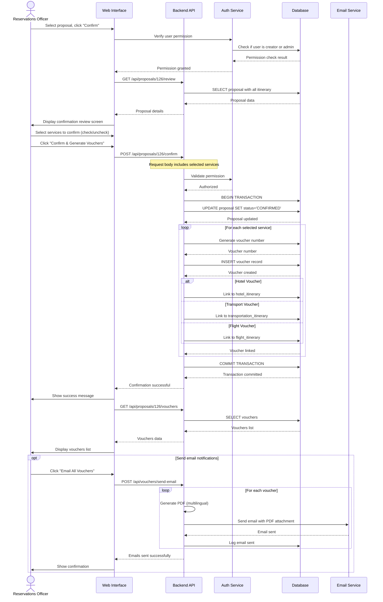
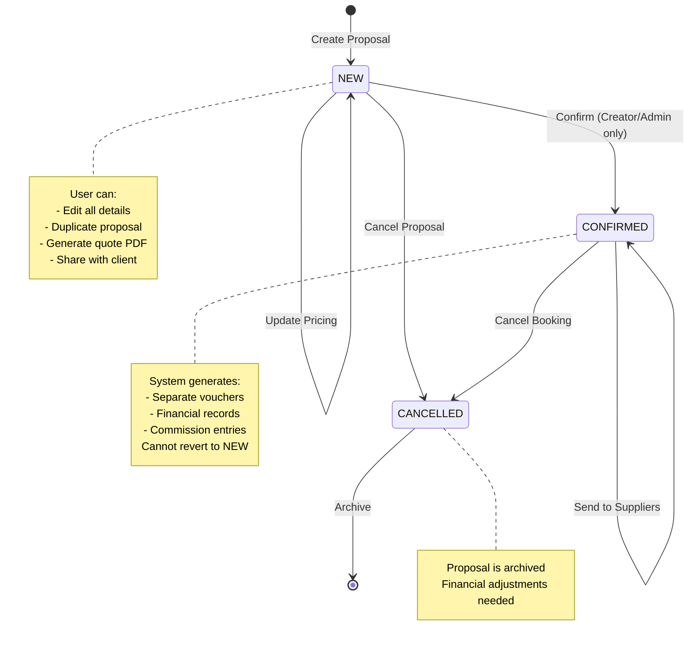
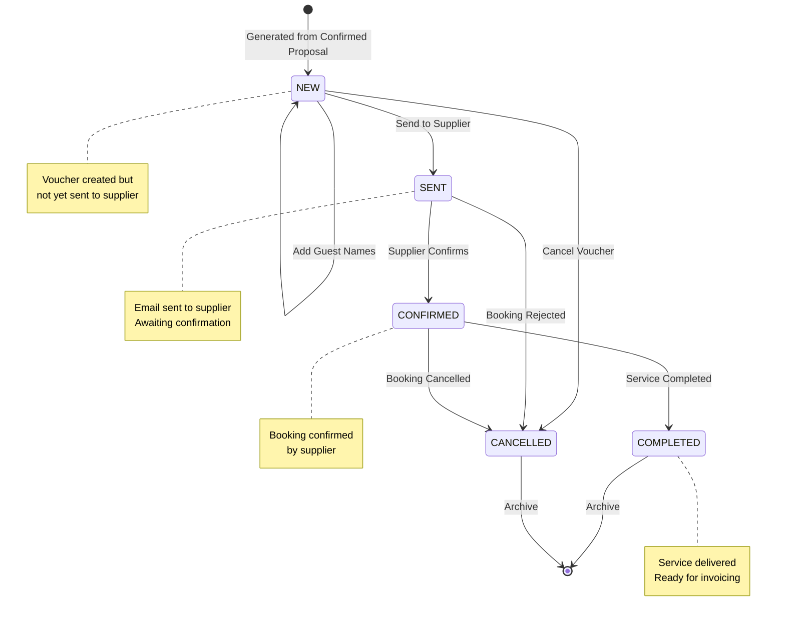
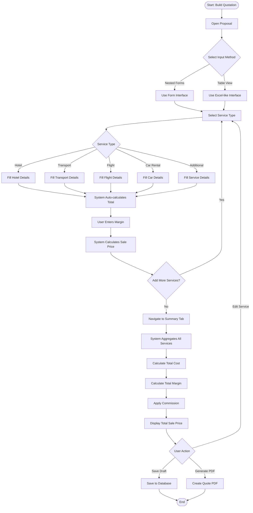

# TOMS - UML Diagrams

## 1. USE CASE DIAGRAM

```
                        Tourism Operations Management System (TOMS)

┌─────────────────────────────────────────────────────────────────────────┐
│                                                                         │
│                          ┌──────────────┐                               │
│                          │ Sales        │                               │
│                          │ Employee     │                               │
│                          └───────┬──────┘                               │
│                                  │                                      │
│                    ┌─────────────┼─────────────┐                       │
│                    │             │             │                       │
│            ┌───────▼──────┐  ┌──▼─────────┐  ┌▼──────────────┐        │
│            │ Create       │  │ Duplicate  │  │ View Own      │        │
│            │ Proposal     │  │ Proposal   │  │ Commission    │        │
│            └──────────────┘  └────────────┘  └───────────────┘        │
│                    │                                                    │
│            ┌───────▼──────┐                                             │
│            │ Build        │                                             │
│            │ Quotation    │◄──────┐                                    │
│            └──────────────┘       │                                    │
│                    │               │                                    │
│            ┌───────▼──────┐       │                                    │
│            │ Generate     │       │                                    │
│            │ PDF Quote    │       │                                    │
│            └──────────────┘       │                                    │
│                                    │                                    │
│          ┌──────────────┐         │                                    │
│          │ Reservations │         │                                    │
│          │ Officer      │         │                                    │
│          └──────┬───────┘         │                                    │
│                 │                 │                                    │
│       ┌─────────┼─────────┐       │                                    │
│       │         │         │       │                                    │
│  ┌────▼───┐ ┌──▼──────┐ ┌▼───────▼─────┐                             │
│  │ Confirm│ │ Generate│ │ Add Guest    │                             │
│  │Proposal│ │ Vouchers│ │ Information  │                             │
│  └────────┘ └──┬──────┘ └──────────────┘                             │
│                 │                                                      │
│          ┌──────▼──────┐                                               │
│          │ Email       │                                               │
│          │ Vouchers    │                                               │
│          └─────────────┘                                               │
│                                                                         │
│          ┌──────────────┐                                              │
│          │ Operations   │                                              │
│          │ Officer      │                                              │
│          └──────┬───────┘                                              │
│                 │                                                      │
│       ┌─────────┼─────────┐                                           │
│       │         │         │                                           │
│  ┌────▼───┐ ┌──▼──────┐ ┌▼──────────┐                                │
│  │ Track  │ │ Manage  │ │ Update    │                                │
│  │Bookings│ │Vouchers │ │ Status    │                                │
│  └────────┘ └─────────┘ └───────────┘                                │
│                                                                         │
│          ┌──────────────┐                                              │
│          │ Accounting   │                                              │
│          │ Officer      │                                              │
│          └──────┬───────┘                                              │
│                 │                                                      │
│       ┌─────────┼─────────────┐                                       │
│       │         │             │                                       │
│  ┌────▼───┐ ┌──▼─────────┐ ┌─▼──────────┐                            │
│  │ View   │ │ Calculate  │ │ Track      │                            │
│  │Financial│ │Commission │ │ Payments   │                            │
│  │ Reports│ └────────────┘ └────────────┘                            │
│  └────┬───┘                                                            │
│       │                                                                │
│       │    ┌──────────────┐                                           │
│       │    │ Super        │                                           │
│       │    │ Admin        │                                           │
│       │    └──────┬───────┘                                           │
│       │           │                                                    │
│       │  ┌────────┼────────────┬──────────────┐                      │
│       │  │        │            │              │                      │
│  ┌────▼──▼─┐  ┌──▼──────┐  ┌──▼─────────┐ ┌─▼──────────┐            │
│  │ Generate│  │ Manage  │  │ Manage     │ │ Manage     │            │
│  │ Reports │  │  Users  │  │Master Data │ │ All        │            │
│  │         │  │         │  │            │ │ Proposals  │            │
│  └─────────┘  └─────────┘  └────────────┘ └────────────┘            │
│                                                                         │
│                          «extend»                                      │
│             ┌────────────────────────────────────┐                    │
│             │ Import Master Data from Excel      │                    │
│             └────────────────────────────────────┘                    │
│                                                                         │
└─────────────────────────────────────────────────────────────────────────┘

Legend:
• Actors are shown outside the system boundary
• Use cases are shown as ovals inside the system
• Lines show interactions between actors and use cases
• «extend» indicates optional functionality
```

---

## 2. CLASS DIAGRAM

```mermaid
classDiagram
    class User {
        +int id
        +string email
        +string password_hash
        +string first_name
        +string last_name
        +string phone
        +UserRole role
        +boolean is_active
        +datetime created_at
        +datetime updated_at
        +login()
        +logout()
        +resetPassword()
    }

    class UserRole {
        <<enumeration>>
        SALES_EMPLOYEE
        RESERVATIONS_OFFICER
        OPERATIONS_OFFICER
        ACCOUNTING_OFFICER
        SUPER_ADMIN
    }

    class Agency {
        +int id
        +string name
        +int country_id
        +int region_id
        +int city_id
        +string contact_person
        +string email
        +string phone
        +string address
        +boolean is_active
        +datetime created_at
        +getFullLocation()
    }

    class Country {
        +int id
        +string name
        +string code
    }

    class Region {
        +int id
        +string name
        +int country_id
    }

    class City {
        +int id
        +string name
        +int region_id
    }

    class Destination {
        +int id
        +string name
        +int city_id
        +string description
        +boolean is_active
        +datetime created_at
    }

    class Hotel {
        +int id
        +string name
        +int city_id
        +int star_rating
        +string address
        +string phone
        +string email
        +boolean is_active
        +datetime created_at
    }

    class Proposal {
        +int id
        +string reference_number
        +int user_id
        +ProposalSource source
        +int agency_id
        +int destination_id
        +int estimated_nights
        +ProposalStatus status
        +decimal total_cost
        +decimal total_margin
        +decimal commission_percent
        +decimal total_sale
        +datetime created_at
        +datetime updated_at
        +datetime confirmed_at
        +calculateTotals()
        +generateQuotePDF()
        +confirm()
        +cancel()
        +duplicate()
    }

    class ProposalSource {
        <<enumeration>>
        B2C
        B2B
        SALES_EMPLOYEE
        MANAGER
        OTHER
    }

    class ProposalStatus {
        <<enumeration>>
        NEW
        CONFIRMED
        CANCELLED
    }

    class HotelItinerary {
        +int id
        +int proposal_id
        +int hotel_id
        +int city_id
        +date checkin_date
        +date checkout_date
        +int nights
        +RoomType room_type
        +BoardType board_type
        +int number_of_rooms
        +string currency
        +decimal price_per_night
        +decimal total_price
        +decimal margin_percent
        +decimal margin_amount
        +decimal sale_price
        +datetime created_at
        +calculateNights()
        +calculateTotal()
    }

    class RoomType {
        <<enumeration>>
        SINGLE
        DOUBLE
        TRIPLE
        QUAD
    }

    class BoardType {
        <<enumeration>>
        BB
        HB
        FB
        RO
    }

    class TransportationItinerary {
        +int id
        +int proposal_id
        +int city_id
        +date service_date
        +string service_description
        +string vehicle_type
        +int number_of_days
        +string currency
        +decimal price_per_day
        +decimal total_price
        +decimal margin_percent
        +decimal margin_amount
        +decimal sale_price
        +datetime created_at
        +calculateTotal()
    }

    class FlightItinerary {
        +int id
        +int proposal_id
        +int city_id
        +date flight_date
        +string departure
        +string arrival
        +string departure_time
        +FlightType flight_type
        +int pax
        +string currency
        +decimal price_per_pax
        +decimal total_price
        +decimal margin_percent
        +decimal margin_amount
        +decimal sale_price
        +datetime created_at
        +calculateTotal()
    }

    class FlightType {
        <<enumeration>>
        DOMESTIC
        INTERNATIONAL
    }

    class RentACarItinerary {
        +int id
        +int proposal_id
        +int city_id
        +date rental_date
        +string car_type
        +int number_of_days
        +string currency
        +decimal price_per_day
        +decimal total_price
        +decimal margin_percent
        +decimal margin_amount
        +decimal sale_price
        +datetime created_at
        +calculateTotal()
    }

    class AdditionalServiceItinerary {
        +int id
        +int proposal_id
        +int city_id
        +date service_date
        +string service_description
        +int number_of_days
        +string currency
        +decimal price_per_day
        +decimal total_price
        +decimal margin_percent
        +decimal margin_amount
        +decimal sale_price
        +datetime created_at
        +calculateTotal()
    }

    class Voucher {
        +int id
        +string voucher_number
        +int proposal_id
        +VoucherType voucher_type
        +int itinerary_id
        +VoucherStatus status
        +string notes
        +int adults
        +int children
        +int total_pax
        +decimal cost
        +decimal sale_price
        +datetime created_at
        +datetime updated_at
        +generatePDF(language)
        +sendEmail(recipient)
    }

    class VoucherType {
        <<enumeration>>
        HOTEL
        TRANSPORTATION
        FLIGHT
        RENT_A_CAR
        ADDITIONAL_SERVICE
    }

    class VoucherStatus {
        <<enumeration>>
        NEW
        SENT
        CONFIRMED
        COMPLETED
        CANCELLED
    }

    class VoucherGuest {
        +int id
        +int voucher_id
        +string first_name
        +string last_name
        +string passport_number
        +date date_of_birth
        +datetime created_at
    }

    class Payment {
        +int id
        +int proposal_id
        +PaymentType payment_type
        +decimal amount
        +string currency
        +date payment_date
        +PaymentStatus status
        +string reference
        +string notes
        +datetime created_at
    }

    class PaymentType {
        <<enumeration>>
        RECEIVED_FROM_CLIENT
        PAID_TO_SUPPLIER
    }

    class PaymentStatus {
        <<enumeration>>
        PENDING
        COMPLETED
        FAILED
    }

    class Commission {
        +int id
        +int user_id
        +int proposal_id
        +decimal commission_amount
        +decimal commission_percent
        +CommissionStatus status
        +date payment_date
        +datetime created_at
    }

    class CommissionStatus {
        <<enumeration>>
        PENDING
        PAID
    }

    class ActivityLog {
        +int id
        +int user_id
        +string action
        +string entity_type
        +int entity_id
        +json old_values
        +json new_values
        +datetime created_at
    }

    %% Relationships
    User "1" --> "1" UserRole : has
    User "1" --> "*" Proposal : creates
    User "1" --> "*" Commission : earns
    User "1" --> "*" ActivityLog : performs

    Agency "*" --> "1" Country : located in
    Agency "*" --> "1" Region : located in
    Agency "*" --> "1" City : located in
    Agency "1" --> "*" Proposal : receives

    Region "*" --> "1" Country : belongs to
    City "*" --> "1" Region : belongs to

    Destination "*" --> "1" City : located in
    Hotel "*" --> "1" City : located in

    Proposal "1" --> "1" ProposalSource : has
    Proposal "1" --> "1" ProposalStatus : has
    Proposal "*" --> "0..1" Agency : for
    Proposal "*" --> "1" Destination : to
    Proposal "1" --> "*" HotelItinerary : contains
    Proposal "1" --> "*" TransportationItinerary : contains
    Proposal "1" --> "*" FlightItinerary : contains
    Proposal "1" --> "*" RentACarItinerary : contains
    Proposal "1" --> "*" AdditionalServiceItinerary : contains
    Proposal "1" --> "*" Voucher : generates
    Proposal "1" --> "*" Payment : has
    Proposal "1" --> "*" Commission : generates

    HotelItinerary "*" --> "1" Hotel : books
    HotelItinerary "*" --> "1" City : in
    HotelItinerary "1" --> "1" RoomType : has
    HotelItinerary "1" --> "1" BoardType : includes

    TransportationItinerary "*" --> "1" City : in
    FlightItinerary "*" --> "1" City : in
    FlightItinerary "1" --> "1" FlightType : has
    RentACarItinerary "*" --> "1" City : in
    AdditionalServiceItinerary "*" --> "1" City : in

    Voucher "1" --> "1" VoucherType : has
    Voucher "1" --> "1" VoucherStatus : has
    Voucher "1" --> "*" VoucherGuest : includes

    Payment "1" --> "1" PaymentType : has
    Payment "1" --> "1" PaymentStatus : has

    Commission "1" --> "1" CommissionStatus : has
```



---

## 3. SEQUENCE DIAGRAM - Create Proposal



---

## 4. SEQUENCE DIAGRAM - Confirm Proposal & Generate Vouchers



---

## 5. ENTITY-RELATIONSHIP DIAGRAM (ERD)

```
┌─────────────────┐
│     users       │
├─────────────────┤
│ PK  id          │
│     email       │
│     password    │
│     first_name  │
│     last_name   │
│     role        │
│     is_active   │
│     created_at  │
└────────┬────────┘
         │
         │ creates
         │
         ▼
┌─────────────────────────────────────────┐         ┌─────────────┐
│           proposals                     │────────▶│  agencies   │
├─────────────────────────────────────────┤  for    ├─────────────┤
│ PK  id                                  │         │ PK  id      │
│ FK  user_id                             │         │     name    │
│     reference_number (UNIQUE)           │         │ FK  city_id │
│     source (ENUM)                       │         │     contact │
│ FK  agency_id (nullable)                │         │     email   │
│ FK  destination_id                      │         └─────────────┘
│     estimated_nights                    │
│     status (ENUM: NEW, CONFIRMED, ...)  │
│     total_cost                          │         ┌──────────────┐
│     total_margin                        │────────▶│ destinations │
│     commission_percent                  │   to    ├──────────────┤
│     total_sale                          │         │ PK  id       │
│     created_at                          │         │     name     │
│     confirmed_at                        │         │ FK  city_id  │
└────────┬────────────────────────────────┘         └──────────────┘
         │
         │ has
         ├──────────────┬──────────────┬─────────────┬──────────────┐
         ▼              ▼              ▼             ▼              ▼
┌────────────────┐ ┌────────────┐ ┌────────────┐ ┌──────────┐ ┌──────────┐
│hotel_itinerary │ │transport.  │ │  flight_   │ │ rent_a   │ │additional│
├────────────────┤ │ _itinerary │ │ itinerary  │ │ _car_it. │ │ _service │
│ PK  id         │ ├────────────┤ ├────────────┤ ├──────────┤ ├──────────┤
│ FK  proposal_id│ │ PK  id     │ │ PK  id     │ │ PK  id   │ │ PK  id   │
│ FK  hotel_id   │ │FK proposal │ │FK proposal │ │FK prop.  │ │FK prop.  │
│ FK  city_id    │ │FK city_id  │ │FK city_id  │ │FK city   │ │FK city   │
│     checkin    │ │    date    │ │    date    │ │    date  │ │    date  │
│     checkout   │ │    service │ │    depart. │ │    car   │ │  service │
│     nights     │ │    vehicle │ │    arrival │ │    days  │ │    days  │
│     room_type  │ │    days    │ │    time    │ │  price   │ │  price   │
│     board_type │ │    price   │ │    type    │ │  total   │ │  total   │
│     num_rooms  │ │    total   │ │    pax     │ │  margin  │ │  margin  │
│     currency   │ │    margin  │ │    price   │ │  sale    │ │  sale    │
│     price      │ │    sale    │ │    total   │ └──────────┘ └──────────┘
│     total      │ └────────────┘ │    margin  │
│     margin     │                │    sale    │
│     sale       │                └────────────┘
└────────┬───────┘
         │
         │ books
         ▼
┌─────────────────┐
│     hotels      │
├─────────────────┤
│ PK  id          │
│     name        │
│ FK  city_id     │
│     star_rating │
│     address     │
└─────────────────┘


┌─────────────────────────────────────────┐
│           proposals                     │
└────────┬────────────────────────────────┘
         │
         │ generates
         ▼
┌─────────────────────────┐
│        vouchers         │
├─────────────────────────┤
│ PK  id                  │
│     voucher_number      │
│ FK  proposal_id         │
│     voucher_type (ENUM) │
│     itinerary_id        │◄─── Links to specific itinerary
│     status (ENUM)       │     (hotel, transport, flight, etc.)
│     notes               │
│     adults              │
│     children            │
│     total_pax           │
│     cost                │
│     sale_price          │
│     created_at          │
└────────┬────────────────┘
         │
         │ includes
         ▼
┌─────────────────────────┐
│     voucher_guests      │
├─────────────────────────┤
│ PK  id                  │
│ FK  voucher_id          │
│     first_name          │
│     last_name           │
│     passport_number     │
│     date_of_birth       │
└─────────────────────────┘


┌─────────────────────────────────────────┐
│           proposals                     │
└────────┬────────────────────────────────┘
         │
         ├─────────────┐
         │             │
         │ has         │ generates
         ▼             ▼
┌─────────────────┐ ┌─────────────────┐
│    payments     │ │   commissions   │
├─────────────────┤ ├─────────────────┤
│ PK  id          │ │ PK  id          │
│ FK  proposal_id │ │ FK  user_id     │
│     type (ENUM) │ │ FK  proposal_id │
│     amount      │ │     amount      │
│     currency    │ │     percent     │
│     date        │ │     status      │
│     status      │ │     payment_date│
└─────────────────┘ └─────────────────┘


        LOCATION HIERARCHY

┌─────────────┐
│  countries  │
├─────────────┤
│ PK  id      │
│     name    │
│     code    │
└──────┬──────┘
       │
       │ contains
       ▼
┌─────────────┐
│   regions   │
├─────────────┤
│ PK  id      │
│     name    │
│ FK  country │
└──────┬──────┘
       │
       │ contains
       ▼
┌─────────────┐
│   cities    │
├─────────────┤
│ PK  id      │
│     name    │
│ FK  region  │
└─────────────┘


        AUDIT LOG

┌─────────────────────┐
│   activity_logs     │
├─────────────────────┤
│ PK  id              │
│ FK  user_id         │
│     action          │
│     entity_type     │
│     entity_id       │
│     old_values      │
│     new_values      │
│     created_at      │
└─────────────────────┘
```

---

## 6. STATE DIAGRAM - Proposal Status



---

## 7. STATE DIAGRAM - Voucher Status



---

## 8. ACTIVITY DIAGRAM - Quotation Building Process



---

## 9. COMPONENT DIAGRAM

```
┌────────────────────────────────────────────────────────────────┐
│                      TOMS System Architecture                  │
└────────────────────────────────────────────────────────────────┘

┌─────────────────────────────── PRESENTATION LAYER ─────────────┐
│                                                                 │
│  ┌──────────────┐  ┌──────────────┐  ┌──────────────┐        │
│  │   Web UI     │  │   Reports    │  │    Admin     │        │
│  │  (React)     │  │  Dashboard   │  │   Console    │        │
│  └──────┬───────┘  └──────┬───────┘  └──────┬───────┘        │
│         │                 │                 │                 │
└─────────┼─────────────────┼─────────────────┼─────────────────┘
          │                 │                 │
          └─────────────────┴─────────────────┘
                            │
                            ▼
┌─────────────────────────────── API LAYER ──────────────────────┐
│                                                                 │
│  ┌───────────────────────────────────────────────────────┐    │
│  │               RESTful API Gateway                     │    │
│  │              (Express.js / Node.js)                   │    │
│  └─────────────────────┬─────────────────────────────────┘    │
│                        │                                       │
│  ┌─────────┬──────────┼──────────┬───────────┬──────────┐    │
│  │         │          │          │           │          │    │
│  ▼         ▼          ▼          ▼           ▼          ▼    │
│ ┌───┐   ┌───┐      ┌───┐      ┌───┐      ┌───┐      ┌───┐  │
│ │Pro│   │Quot│      │Vouc│      │Mast│      │Finan│      │User│  │
│ │pos│   │atio│      │her │      │er  │      │cial│      │Mgt │  │
│ │als│   │n   │      │API │      │Data│      │API │      │API │  │
│ └─┬─┘   └─┬─┘      └─┬─┘      └─┬─┘      └─┬─┘      └─┬─┘  │
│   │       │          │          │          │          │      │
└───┼───────┼──────────┼──────────┼──────────┼──────────┼──────┘
    │       │          │          │          │          │
    └───────┴──────────┴──────────┴──────────┴──────────┘
                       │
                       ▼
┌─────────────────────────── BUSINESS LOGIC LAYER ───────────────┐
│                                                                 │
│  ┌──────────────┐  ┌──────────────┐  ┌──────────────┐        │
│  │  Proposal    │  │  Quotation   │  │   Voucher    │        │
│  │  Service     │  │  Service     │  │   Service    │        │
│  └──────┬───────┘  └──────┬───────┘  └──────┬───────┘        │
│         │                 │                 │                 │
│  ┌──────┴────────┐  ┌─────┴────────┐  ┌─────┴────────┐       │
│  │  Pricing      │  │  Calculation │  │  PDF         │       │
│  │  Engine       │  │  Engine      │  │  Generator   │       │
│  └───────────────┘  └──────────────┘  └──────────────┘       │
│                                                                 │
│  ┌──────────────┐  ┌──────────────┐  ┌──────────────┐        │
│  │  Financial   │  │  Report      │  │  Email       │        │
│  │  Service     │  │  Service     │  │  Service     │        │
│  └──────────────┘  └──────────────┘  └──────────────┘        │
│                                                                 │
└─────────────────────────────────────────────────────────────────┘
                            │
                            ▼
┌─────────────────────────── DATA ACCESS LAYER ──────────────────┐
│                                                                 │
│  ┌───────────────────────────────────────────────────────┐    │
│  │            Data Access Objects (DAOs)                 │    │
│  │         Repository Pattern Implementation             │    │
│  └───────────────────────────────────────────────────────┘    │
│                                                                 │
└─────────────────────────────────────────────────────────────────┘
                            │
                            ▼
┌─────────────────────────── DATA LAYER ─────────────────────────┐
│                                                                 │
│  ┌───────────────────────────────────────────────────────┐    │
│  │         Relational Database (PostgreSQL)              │    │
│  │  - Users & Permissions                                │    │
│  │  - Proposals & Itineraries                            │    │
│  │  - Vouchers & Guests                                  │    │
│  │  - Master Data (Agencies, Hotels, Destinations)       │    │
│  │  - Financial Records                                  │    │
│  │  - Activity Logs                                      │    │
│  └───────────────────────────────────────────────────────┘    │
│                                                                 │
└─────────────────────────────────────────────────────────────────┘


┌───────────────────── EXTERNAL SERVICES ─────────────────────────┐
│                                                                 │
│  ┌──────────────┐  ┌──────────────┐  ┌──────────────┐        │
│  │   Email      │  │   Currency   │  │    Cloud     │        │
│  │   Service    │  │   Exchange   │  │    Storage   │        │
│  │   (SMTP)     │  │     API      │  │    (S3)      │        │
│  └──────────────┘  └──────────────┘  └──────────────┘        │
│                                                                 │
└─────────────────────────────────────────────────────────────────┘
```

---

## KEY RELATIONSHIPS SUMMARY

### 1. **User → Proposal** (1:N)

- One user creates many proposals
- User is tracked as the creator

### 2. **Proposal → Itineraries** (1:N)

- One proposal has many services (hotels, flights, transport, etc.)
- Each itinerary type is a separate table

### 3. **Proposal → Vouchers** (1:N)

- When confirmed, one proposal generates multiple vouchers
- One voucher per service item

### 4. **Voucher → VoucherGuests** (1:N)

- One voucher can have multiple guests
- Guest information stored separately

### 5. **Agency → Country → Region → City** (Hierarchical)

- Location data is normalized
- Allows for flexible location selection

### 6. **Proposal → Commission** (1:N)

- One proposal can generate commissions for multiple users
- Tracks sales commissions

### 7. **Proposal → Payments** (1:N)

- One proposal tracks multiple payments
- Both received and paid-out payments

---

## DESIGN PATTERNS USED

1. **Repository Pattern**: Data access abstraction
2. **Service Layer Pattern**: Business logic encapsulation
3. **Factory Pattern**: Object creation (vouchers, PDFs)
4. **Observer Pattern**: Status change notifications
5. **Strategy Pattern**: Pricing calculation methods
6. **Template Method**: PDF generation templates
7. **MVC Pattern**: Overall architecture structure